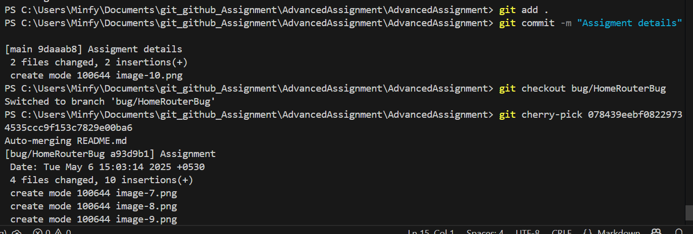

# AdvancedAssignment
Assignment 5: Collaborative Project with Advanced Git Techniques 

<h4> Protected Branch </h4>

<h4>Created Multiple Branches for various features </h4>

<h4> Created Project Board and assigned developers for different features </h4>

<h4>Commits</h4>

<h4> Branches </h4>

<h4> Git Rebase </h4>

<h4> Use of cherry-pick </h4>

### Work Done
- First, we created a main branch which has a basic code
- Next, we made 3 different branches and worked on different issues.
- `Rohan` resolved `Home Router` Issue
- `Samrath` resolved `About Router` Issue
- `Midhilesh` resolved `Contacts Router` Issue
- Next, we `Merged` the branches into the main branch
- We used `rebase` function to edit the commits
- We used `cherry-pick` to get commit of main branch to bug branch
