# AdvancedAssignment
Assignment 5: Collaborative Project with Advanced Git Techniques 

<h4> Protected Branch </h4>

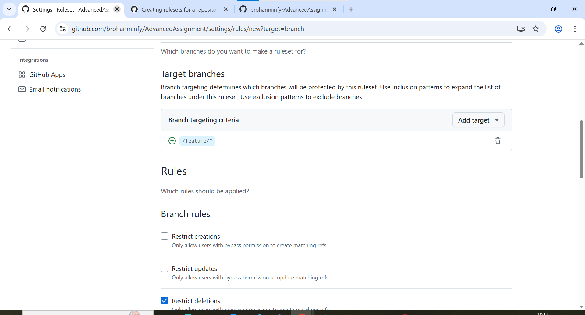

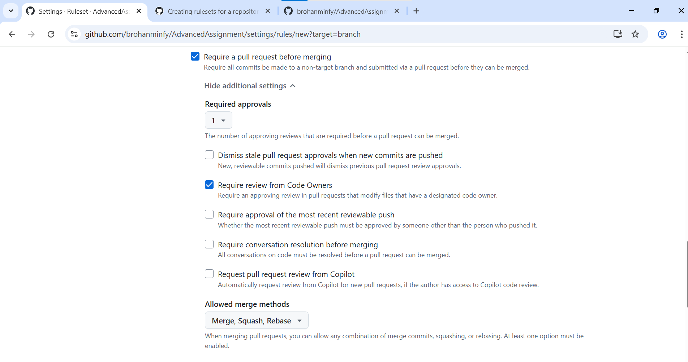

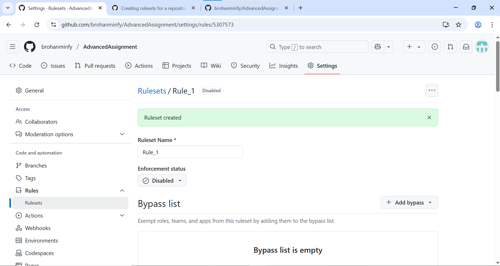

<h4>Created Multiple Branches for various features </h4>

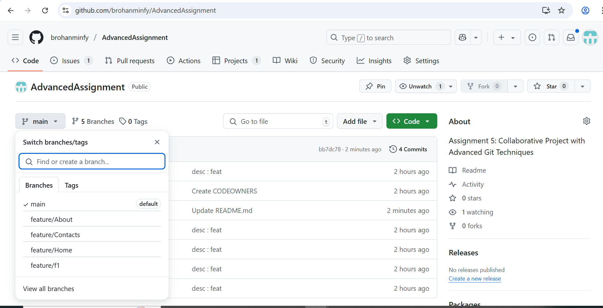

<h4> Created Project Board and assigned developers for different features </h4>

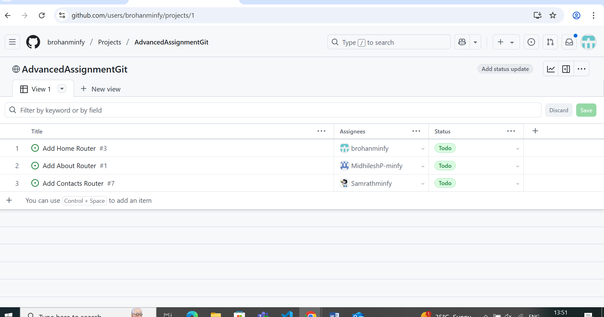

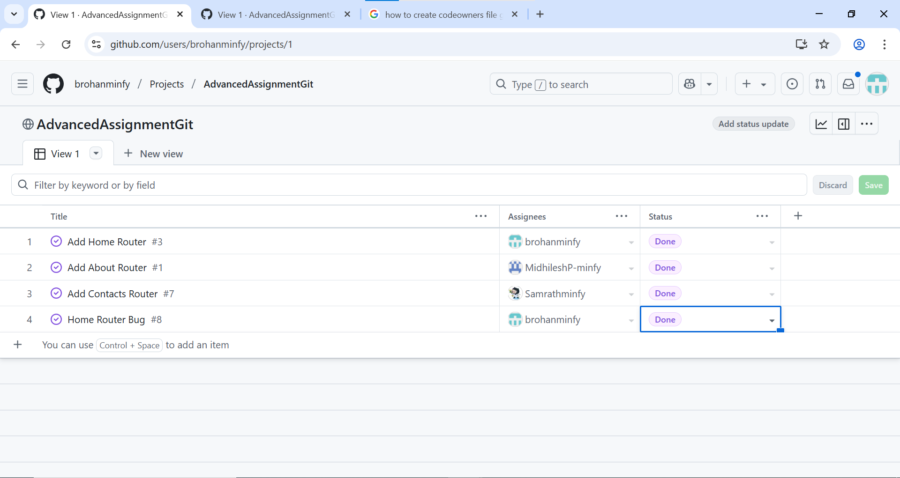

<h4>Commits</h4>

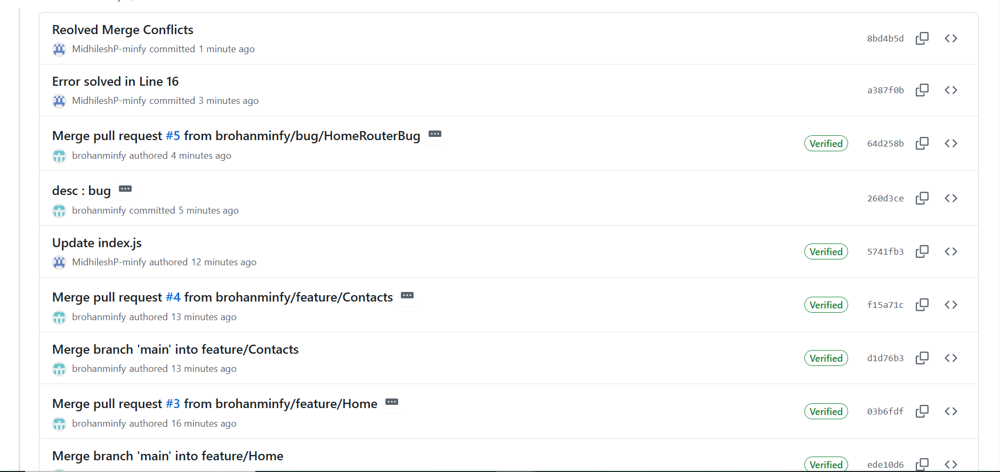

<h4> Branches </h4>

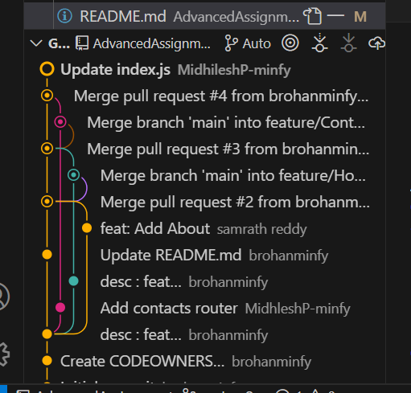

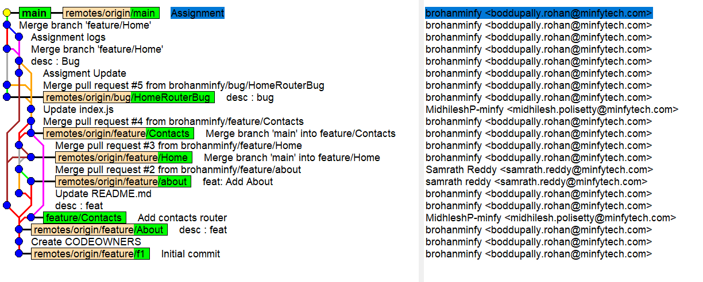

<h4> Git Rebase </h4>

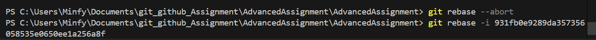

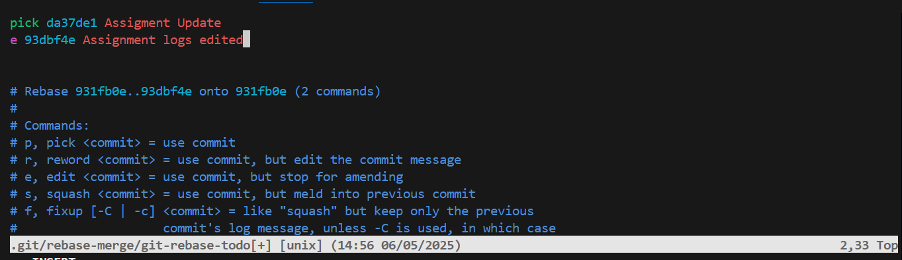

